# TD_CASE_KFA  

KFA Entertainment için hazırlanmış **Tower Defence prototip projesi**.  
Bu proje, **Unity** kullanılarak 3D ortamda **2D sprite (billboard tekniği)** ile temel oyun döngüsünün oynanabilir bir şekilde geliştirilmesini amaçlamaktadır.  

---

## 🎯 Amaç  
- Unity oyun motoruna hâkimiyet göstermek.  
- Temel oyun döngüsünü sağlıklı bir şekilde kurmak.  
- Kod yapısını anlaşılır ve sürdürülebilir biçimde oluşturmak.  

---

## 📖 Senaryo  
- Tower Defence türünde bir oyun.  
- Düşmanlar dalga dalga gelir ve belirlenmiş yolu takip eder.  
- Oyuncu WASD ile hareket eder, en yakındaki düşmana otomatik saldırır (yakın veya menzilli olucak şekilde ayarlanmış bir script mevcuttur).  

---
## Player  

Karakterimiz WASD hareket edebiliyor, en yakın düşmana alev topu fırlatabiliyor ve bu alev topu 20 puan hasar veriyor.  

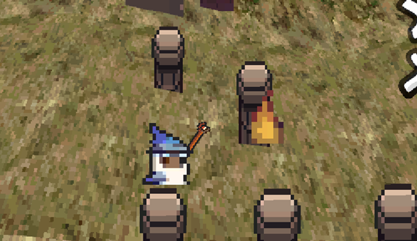

---

### Player Kullanılabilir Özellikler ve UI  

Her öldürülen düşmandan 10 skor puanı kazanılır.  
200 skor puanına ulaşıldığında 200 azalacak şekilde 2 özellik kullanılabilir:  
- Can Tamamlama  
- Ok Yağdırma  
Bu özellikler UI’da gösterilir.  

**Yeterince puan yoksa:**  
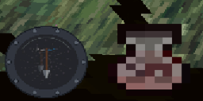

**Yeterince puan varsa:**  
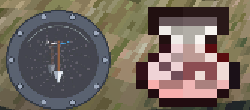

---

### Ok Yağdırma Mekaniği  

- Q tuşu ile çalışır.  
- Yukarıdan aşağıya 1260 ok düşer, her biri 5 can azaltır.  
- Yere düşen oklar bir süre sonra yok olur.  
- Cooldown süresi: 10 saniye (UI’da saat yönünün tersine).  

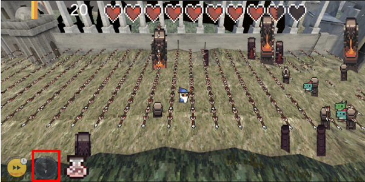

---

### Can Doldurma Mekaniği  

- E tuşu ile çalışır.  
- 200 skor puanı olduğunda kullanılabilir.  
- 20 can doldurur.  
- Cooldown süresi: 10 saniye.  

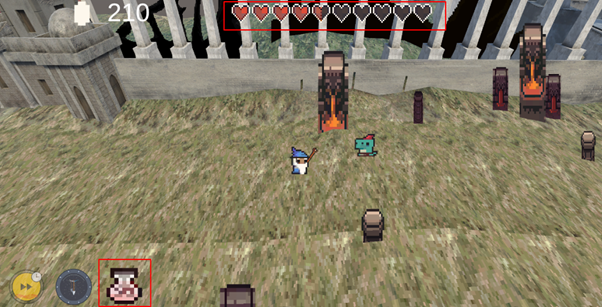  
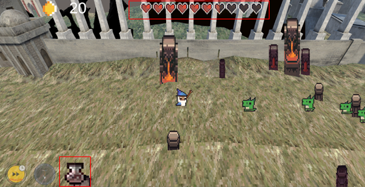
## Düşman Çeşitleri  

Bütün düşmanlar kalenin zırhlı kapısını yok etmeye çalışır ve belirli bir patikada **NavMesh** kullanarak kapıya ulaşmaya çalışır. Eğer kapı yok edilirse oyun biter.  
Not: Enemy patika izleme scriptini ayarlanabilir yaptım. Bu sayede döngü şeklinde git–gel yapabilir veya farklı yollar oluşturulabilir: **Once Stop, Ping Pong, Loop.**

---

### Green Enemy  
Temel düşman çeşididir. Velocity’si 1 olan, en yavaş boss olmayan düşmandır.  
Amacı belirlenen patikayı izleyerek player’a temas ettiğinde hasar vermek, base kapısına ulaşırsa saldırmaktır.  

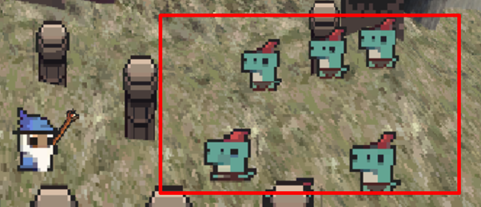

---

### Neon Enemy  
Green Enemy varyasyonudur. Farklı rengi vardır ve daha hızlıdır.  

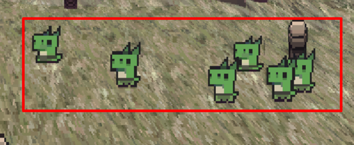

---

### Ranged Enemy (Boss)  
Boss enemy türüdür.  
Farkı: Uzak mesafeden player’a büyük **kar küreleri** fırlatır.  
Bu saldırılar player’ın canını ciddi ölçüde azaltır ve kısa süreliğine **yavaşlatır**.  

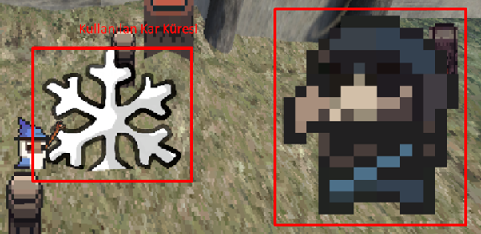

---

## Base  

- 500 cana sahiptir.  
- Düşmanlardan hasar aldıkça can barı azalır.  
- Can biterse yok olur ve oyun **Ana Menü ekranına** döner.  

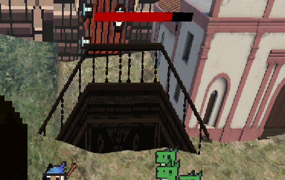

---

## Oyun Genel Akışı  

Proje dalga sistemiyle çalışır.  
- UI üzerinden **kaçıncı dalgada** olunduğu belirtilir.  
- Dalga bittiğinde oyuncu diğer dalgaya geçmek için **6 saniye bekler.**  
- Oyuncu **F tuşuna** basarak dalgayı erkenden başlatabilir.  
- Tüm bu akış kullanıcıya UI üzerinden gösterilir.  

### Dalga Başlangıcı  
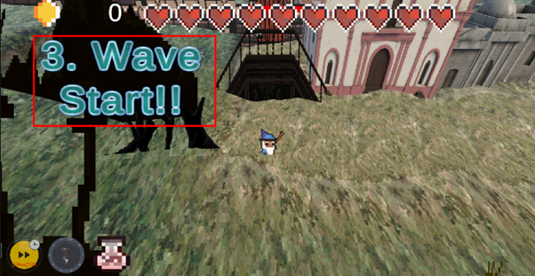

### Dalga Bitimi  
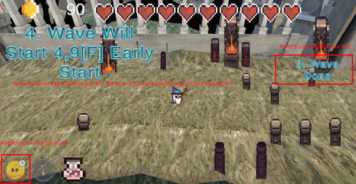

### Erken Başlama UI Aktifleşirse  
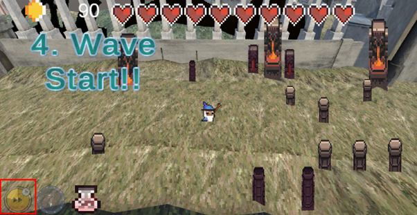
## Ana Oyun UI  

Oyuncunun can barı, kullanabileceği yetenekler ve skor tablosu gösterilir.  

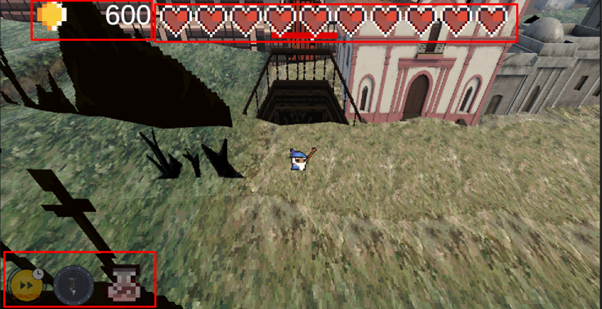

---

## Durdurma Ekranı  

- Oyuncu **ESC** tuşuna bastığında açılır.  
- Açıldığında oyun tamamen donar.  
- “Devam Et” ve “Ana Menü” tuşlarına erişilebilir.  
- Devam Et seçeneği ile oyun kaldığı yerden devam eder.  
- Main Menu seçeneği ile **ana menü ekranına** dönülür.  

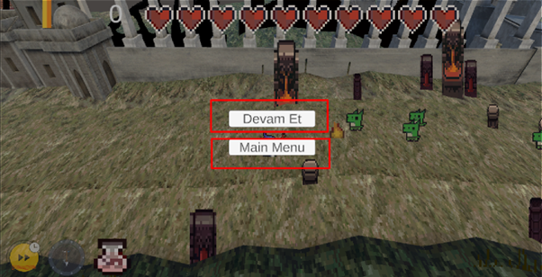

---

## Ana Menü Ekranı  

- Oyunu başlatabilir.  
- Başlangıç dalgası seçilebilir.  
- Oyundan çıkış yapılabilir.  

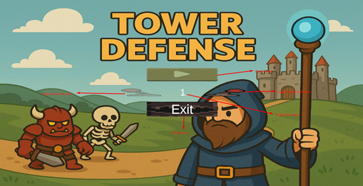
## 🎨 Editor Tasarımı  

### Menu Sahnesi  
- Menü ekranında kullanılan UI elementleri, butonlar, background resmi ve yazılar bulunur.  
- **Wave Selector** adlı mekanik objesi sayesinde istenilen dalga seçilir.  

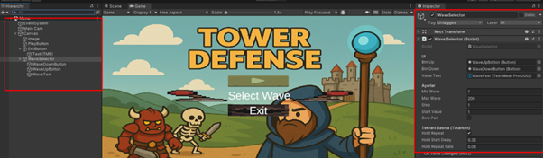

---

### MainCaseGame Sahnesi  

#### Canvas  

- **Score:** Skor tablosu için kullanılır.  
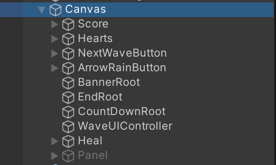

- **Hearts:** Can göstergesi.  
  - Health UI Manager scripti ile her bir kalp UI’ı 3 farklı versiyonuyla belirtilir.  
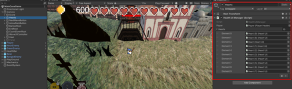

- **NextWaveButton:** Diğer dalgaya erken geçiş için kullanılır.  
  - Next Wave Controller scripti ile WaveSpawner’ı tetikler.  
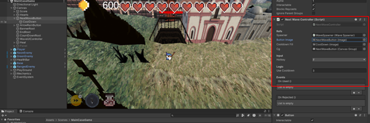

- **ArrowRainButton:** Ok yağmuru mekaniğini görsel olarak destekler.  
  - Cooldown ve aktifleşme için 2D Sprite Renderer içerir.  
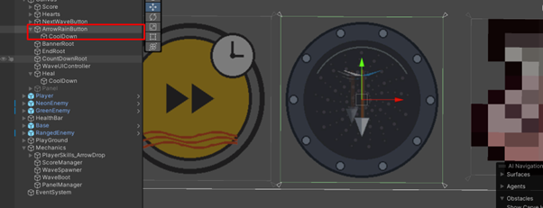

- **WaveUI Controller:** Dalga başlangıcı, geri sayım ve dalga bitişini text olarak gösterir.  
  - BannerRoot, EndRoot, CountDownRoot objelerini içerir.  
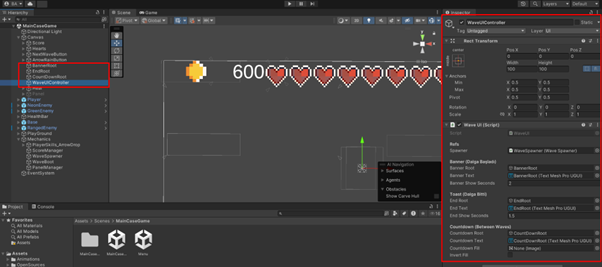

- **Heal Objesi:** Can tamamlama için kullanılır.  
  - Cooldown ve aktifleşme için 2D Sprite Renderer içerir, Heal scriptiyle çalışır.  
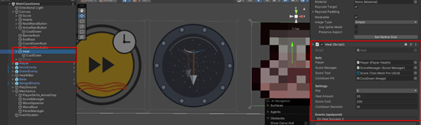

- **Oyuncu Paneli Objesi:**  
  - Anlatılan butonları içerir.  
  - Başlangıçta **deaktif**, mekanik script ile aktifleşir.  
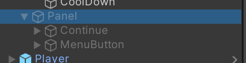
## 👾 Karakterler  

### Player  

- Oyuncunun gittiği yönü takip eden kamera içerir.  
- Ateş etmesi için Fire Pivot ve ilgili objeler bulunur.  
- Character Controller eklenmiştir.  
- 2D görseller için **Visual Root** kullanılır.  
- Animasyonlar **Visual Child** içinde yer alır.  
- Silah görseli için **Visual_Weapon** kullanılır.  

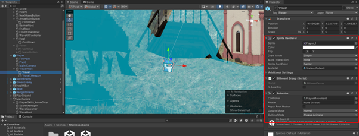

#### Player Scriptleri  
Player’a bağlı scriptler ve inspector kullanımları:  

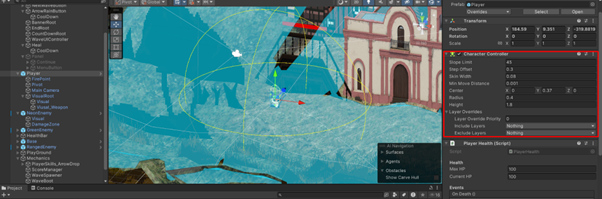  
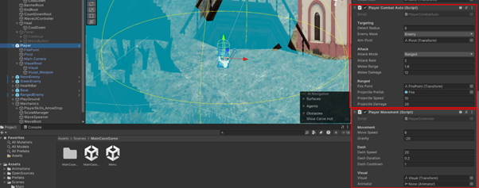  
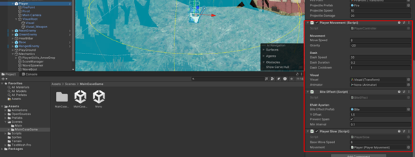

---

### Green Enemy & Neon Enemy  

- NavMesh Surface üzerinde belirlenen yolu takip ederler.  
- **Path scripti** ve **NavMesh Agent** objeleri içerir.  
- Player’a zarar vermek için **Damage Zone** mekaniği bulunur.  
- Character Controller kullanılır.  

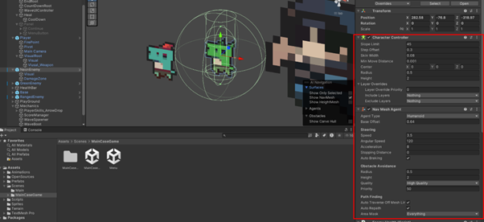  
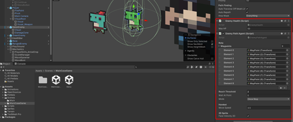

---

### Ranged Enemy (Boss)  

- Normal düşmanlarla aynı scriptleri içerir.  
- Ekstra olarak **EnemyShooter** scripti bulunur.  
- Çıkış noktası transform üzerinden ayarlanır.  
- Player’a menzilli saldırı yapar.  

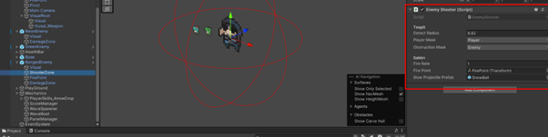  
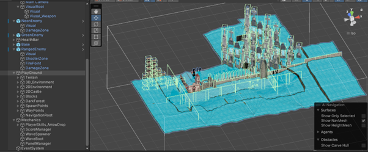  
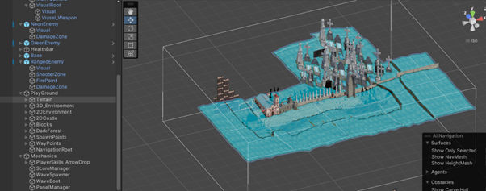  
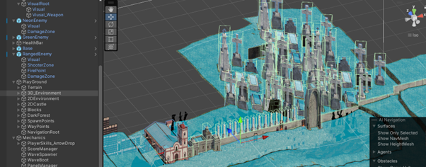
## 🏞️ PlayGround  

- 3D prefablar, 2D prefablar ve zemin için Terrain içerir.  
- NavMesh kullanımı için **Navigation Root** objesi tanımlanmıştır.  
- Oyuncu 2D ve 3D hareketsiz objelere çarpar, içinden geçemez.  
- Alan dışına çıkmaması için görünmez bloklar vardır.  
- Düşmanlar için **WayPoint** sistemi bulunur.  

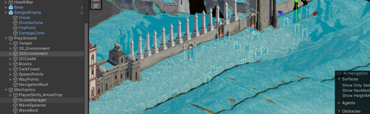  
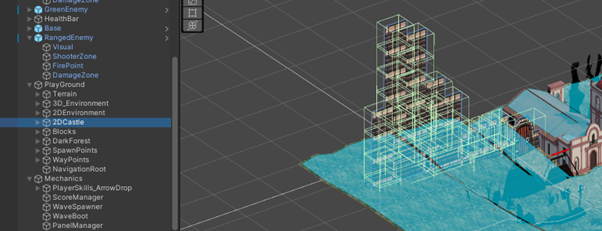  
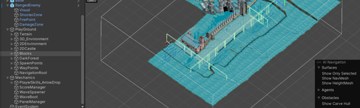  
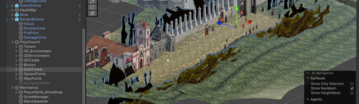  
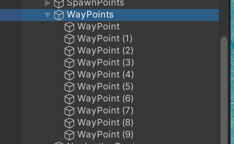  
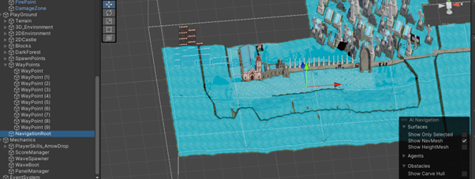

---

## ⚒️ Mekanikler  

### PlayerSkills_ArrowDrop  
- Kullanıcının kullanabilmesi için ok mekanikleri burada yer alır.  
- Ok prefabları ve gerekli scriptleri içerir.  

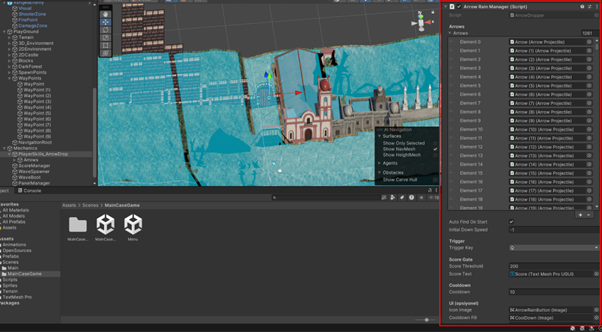  
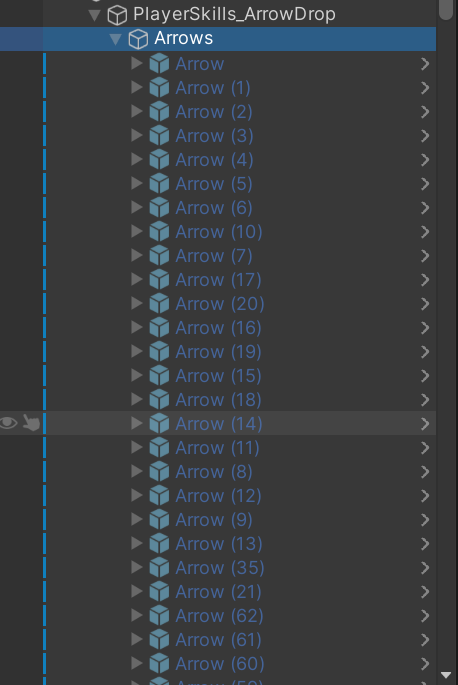

---

### ScoreManager  
- Skor aktif olarak takip edilir.  

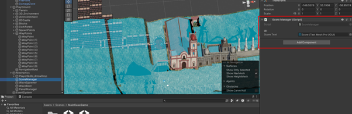

---

### WaveSpawner  
- Dalga sistemini kontrol eder.  
- Düşmanların hangi dalgadan itibaren çıkacağı, spawn sıklığı ve her beş dalgada boss eklenmesi yönetilir.  
- Düşman spawn noktaları transform olarak belirlenmiştir.  

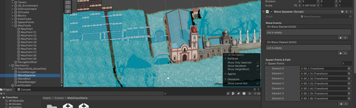  
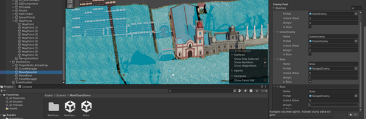  
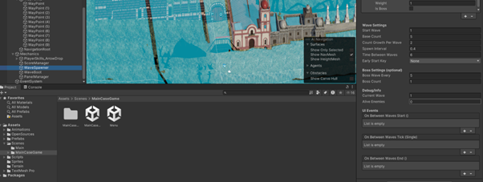

---

### WaveBoot  
- Başlangıç ekranında seçilen dalganın değerini alır.  
- Oyunu seçili dalgadan başlatır.  

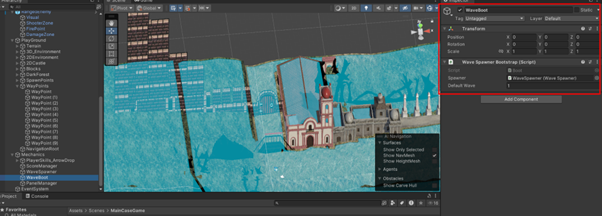

---

### PanelManager  
- Oyuncunun durdurma ekranı panelini kontrol eder.  

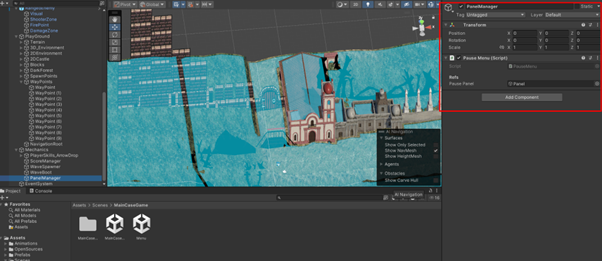

---

### Billboard Mekaniği  
- Tüm 2D objeler kameraya dönük olacak şekilde ayarlanmıştır.  
- İleride görsel çeşitlilik için Y ekseni veya tüm rotasyon bazlı iki seçenek sunulmuştur.  

**Oyun başlamadan önce:**  
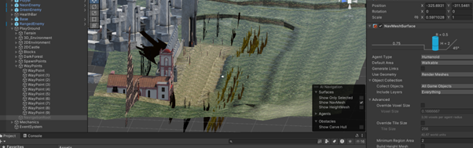

**Oyun başladıktan sonra:**  
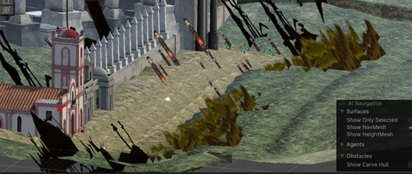

---

## 🗂️ Asset Yapısı  

- MainCaseGame: Ana oynanış sahnesi.  
- Menu: Başlangıç ekranı.  
- Gerekli scriptler alanına göre dosyalanmıştır.  

  
  
  
  
  
  
  
  
  


---

## 🎮 Kontroller  

| Aksiyon | Tuş |
|---|---|
| Hareket | **W/A/S/D** |
| Ok Yağdırma | **Q** |
| Can Doldurma | **E** |
| Dalga Erken Başlat | **F** |
| Duraklat | **ESC** |

---

## 🛠️ Kullanılan Oyun Motoru & Versiyon  

- **Unity**: 2022.3.49f1 (LTS)  
- **Render Pipeline**: Built-in  
- **Platform**: Windows 64-bit  

---

## 📊 Case Gereksinim Eşlemesi  

## ✅ Case Uyum Tablosu

| Case Maddesi                                           | Bu Proje |
|---|---|
| 3D dünyada 2D billboard                                | ✅ |
| WASD hareket                                           | ✅ |
| Otomatik saldırı                                       | ✅ |
| Dalga tabanlı düşmanlar                                | ✅ |
| NavMesh ile yol takibi                                 | ✅ |
| Renk/hız/can farklı düşman                             | ✅ |
| **Erken dalga çağırma** (Extra)                        | ✅ |
| **Başlangıç menüsü** (Extra)                           | ✅ |
| **Boss dalgaları (5., 10., 15.)** (Extra)              | ✅ |
| **Hasar alınca I-frame (geçici yenilmezlik)** (Extra)  | ✅ |
| **Dirilince kısa süreli I-frame + görsel efekt** (Extra)| ✅ |
| **200 skorla Ok Yağmuru + ilgili UI** (Extra)          | ✅ |
| **200 skorla Can Doldurma + ilgili UI** (Extra)        | ✅ |
| **Can gösteren UI (Hearts/Health bar)** (Extra)        | ✅ |


---


## 📜 Lisans & Asset Kredileri  

- **Kod Lisansı**: MIT  
- **Kullanılan Assetler**:  
  - [16x16 Dungeon Tileset (itch.io)](https://0x72.itch.io/16x16-dungeon-tileset)  
  - [Colonial City LittlePack (Unity Asset Store)](https://assetstore.unity.com/packages/3d/environments/urban/colonial-city-littlepack-163089)  
  - [3D Square Tile Terrain Generator (Unity Asset Store)](https://assetstore.unity.com/packages/tools/terrain/3d-square-tile-terrain-generator-237277)  


## 🚀 Kurulum  

Projeyi klonlamak için:  

```bash
git lfs install
git clone https://github.com/BerkayArdaa/TD_CASE_KFA.git
git lfs pull

